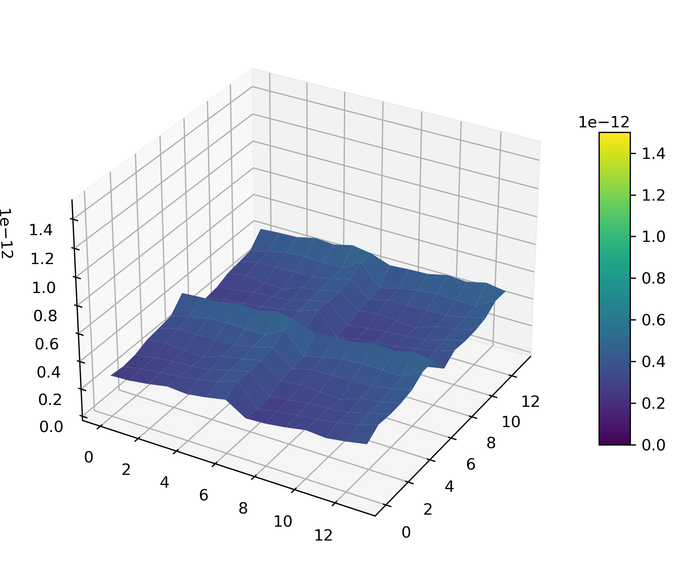

# decap_opt

## Prerequisites
We model the 2.5D hierarchical PDN  by using 'bin' directory, there are three main files that we will use, as follows:
 - **diegen**: generates the on-chip PDN and subckts based on the chip PDN configuration file (e.g.  'config/case1/chiplet1.conf'), the usage is as follows:
```shell 
$ bin/diegen chiplet1.conf
```
 - **intgen**: generates the overall PDN and simulation file ('.sp' file) for the 2.5D architecture, incorporating both the on-chip and interposer PDNs, according to the PDN configuration file (e.g. 'config/case1/intp_chip1.conf'), the usage is as follows:
```shell 
$ bin/intgen intp_chip1.conf
```
 - **inttrvmap**: generates the Voltage Violation Index (VVI) distribution across the on-chip PDN based on time-domain VVI data , the usage is as follows:
```shell 
$ bin/inttrvmap intp_chip1.conf vdi.raw 'Vdd' 'Ripple'
```
There, 'Vdd' and 'Ripple' need to be replaced by the specifics. 'vdi.raw'  contains the time-domain voltage data, which is generated by NGSPICE simulation.

The circuit simulator NGSPICE4 is then  employed for impedance and VVI analysis. You must install it.
```shell 
$ pip install ngspice
```

We mainly us two commands, as follow:
```shell 
$ ngspice interposer_ac.sp # for impedance calculation
$ ngspice -b interposer_tr.sp -r vdi.raw # for VVI calculation 
```

## Configurations

We provide five examples (case1: ROCKET-64, case2: Case1, case3: Case2, case4: Case3, case5: Case4) under the 'conifg' directory, each containing configuration files ('.conf'), netlist files ('.subckt'), and simulation file ('.sp'). Notably, to accelerate simulations in both the frequency and time domains, all netlists are configured without VSS (ground) connections, simplifying the analysis and reducing simulation complexity. 'caseX.conf' configuration file defines the settings for the 2.5D decap optimization case.  Below is a brief description of the key options used in this configuration file:
- **intp_mim**: specifies the number of available unit decap cells (UDCs) on the on-interposer PDN
- **chip_mos**: specifies the number of available UDCs on the on-chip PDNs
- **NCAP**: specifies the total number of available UDCs, including both the on-interposer and on-chip decaps
- **intp_n**: specifies the locations of the non-capacitor zones on the on-interposer PDN
- **chip_n**: specifies the locations of the available UDCs on the on-chip PDNs

## PDN Modeling

<div style="display: flex; align-items: center; justify-content: space-around;">
    
    
</div>

## Experiment Settings 

- **Simulation Setting**: 
<center>
  
| Parameter | Value |
| :-------------------------:|:-------------------------: |
| Vdd				| 0.9 V|
| $ripple$          		| 5% |
| $f_{knee}$       		| 3.4 GHz |
| Impedance(flat)      	| 35 mΩ |
| $\alpha$  			| 0.5 |
| $\beta$         		| 0.5 |
| $\gamma$          		| 0, 0.02, 0.05, 0.10, 0.20, 0.50 |
| Frequency Range      	| 0.1- 20 GHz   |
| Correlation of I/O Currents	| 0.9 |

</center>

- **Hyparameter Setting**: 
<center>
  
| Hyperparameter | Value |
| :-------------------------:|:-------------------------: |
| Activation Function | Linear rectification function|
| Optimizer          		| Adam |
| Learning Rate       	| 2.5E-4 |
| Clip Gradient Norm  	| 0.5 |
| Total Epoch         	| 600 (can be modified) |
| Batch Size          		| 50 |
| Minibatch Size      	| 4   |
| Clipping Coefficient	| 0.1 |
| Entropy Coefficient	| 0.01|
| Value Coefficient   	| 0.5 |
| Discount       		| 0.99|

</center>

- **Deep Nerual Network (DNN) Structure**: 
	- **First Layer**: convolution layer with 4 channels
	- **Second Layer**: convolution layer with 16 channels
	- **Third Layer**: fully connected layer
	- **Value  Network (critic)**:  one fully connected layer
	- **Policy Network (actor)**:  one fully connected layer

## Source Code

### Impedance Optimzation
The 'src/impedance' directory contains the codes for impedance optimization. The state information contains: Interposer Space, Chiplet Space, MIM Distribution, and MOS Distribution.

### Generate I/O Currents

 'src/gen_IOcurrents/gen_current.py' is used to generate varying levels of correlation, which represent different severities of simultaneous switching noise (SSN) in the 2.5D decap optimization.

###  VVI Optimzation

'src/vvi' directory contains the implementation of the VVI optimization algorithms, with two different versions:
 - **vvi_v1**: only considers the VVI information as the state.
 - **vvi_v2**: uses a more comprehensive state representation, taking the state used in impedance optimization into account. After performing impedance optimization, the pre-trained network from that phase can be reused for VVI optimization, which helps in reducing the training time. 

## VVI Distribution after Time-Domain Optimization

</center>
|1|2	|3|
| :-------------------------:|:-------------------------: |:-------------------------: |
|  <br/>(a) Initial VVI |  <br/>(b) $\gamma$=0.50 |   <br/>(b) $\gamma$=0.30 |
</center>
